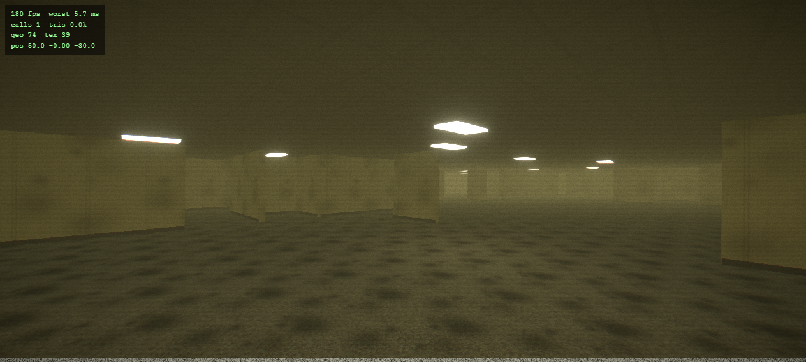

# NOCLIP

> *"If you're not careful and you noclip out of reality in the wrong areas, you'll end up in the Backrooms…"*

**▶ [PLAY IT IN YOUR BROWSER](https://danielkinsner.github.io/backrooms-game/)** — headphones strongly recommended.

A browser-playable, first-person psychological-horror descent into **Level 0 of the Backrooms**,
framed as a recovered camcorder tape from June 12, 2002 — the morning the original Backrooms
photograph was taken at 807 Oregon Street, Oshkosh, Wisconsin.

No jump-scare spam. No monster chases. Six hundred million square miles of damp carpet,
mono-yellow wallpaper, the hum-buzz of fluorescent lights at maximum — and the growing
certainty that the maze knows you're in it.



## How to play

| | |
|---|---|
| **WASD** | walk |
| **SHIFT** | run (running is loud) |
| **CTRL / C** | crouch |
| **SPACE** | climb / mantle |
| **E** | read / interact |
| **RMB (hold)** | camcorder zoom |
| **Q (hold)** | pause the tape |
| **ESC** | menu |

Follow the notes. The exit is down. 20–40 minutes, one sitting, lights off.

## Running locally

```bash
npm ci
npm run dev     # http://localhost:5173
npm run build   # production build to dist/
```

## What's under the hood

- **three.js** (WebGL2) + TypeScript + Vite; pmndrs `postprocessing`; `three-mesh-bvh` collision
- Infinite **seeded chunk-streamed maze** — boundary walls are pure hashes of world coordinates
  (neighbors always agree), zone recipes carve pillar halls / corridors / room clusters,
  a flood-fill pass guarantees no sealed pockets, and the director quietly **re-seeds chunks
  behind your back** so the map in your head rots
- **Procedural sound**: per-fixture fluorescent ballast hum (120 Hz + harmonics) through a pooled
  HRTF spatializer, sub-bass dread bed, 60→90 bpm entrainment heartbeat, distance-triggered
  carpet footsteps, synthesized breath — and scheduled, weaponized **silence**
- **VHS pipeline**: bloom, chromatic aberration, scanlines, tracking wobble, head-switch noise,
  dropouts, tape grade, film grain, vignette, SMAA — with a diegetic camcorder HUD
- A **dread director** pacing wrongness on a 60–120 s cadence (never the same event twice in a
  row), an audio-first stalking presence, and exactly three scripted entity beats

Design doc: [`docs/DESIGN.md`](docs/DESIGN.md) · Research briefs: [`docs/research/`](docs/research/)

## Credits

All assets CC0 / OFL — full manifest in [`docs/ASSET-LICENSES.md`](docs/ASSET-LICENSES.md):
[ambientCG](https://ambientcg.com) (PBR textures), [Kenney](https://kenney.nl) (impact/glitch SFX),
[OpenGameArt](https://opengameart.org) (ambient loops, footsteps, doors),
Google Fonts (VT323, Special Elite).

Lore: the anonymous 2019 4chan /x/ post and the community wikis that grew it.
Aesthetic north star: Kane Pixels' found-footage series.

Built end-to-end with [Claude Code](https://claude.com/claude-code).
